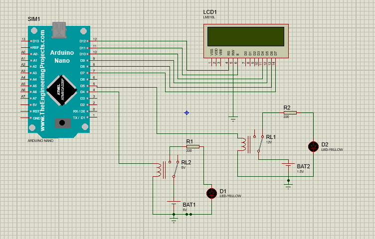

<!DOCTYPE html>
<html>
<head>
   
   </head>
<body>
    <h1 align='center'>RTOS</h1>
    <h2 align='center'>Introdução ao RTOS</h2>
    
Um Sistema Operacional de Tempo Real (RTOS - Real-Time Operating System) é um tipo especializado de sistema operacional projetado para lidar com tarefas em tempo real em sistemas embarcados e sistemas críticos. Ao contrário dos sistemas operacionais convencionais, que priorizam a execução de tarefas de maneira geral, os RTOS fornecem uma execução determinística e previsível das tarefas, garantindo que as operações sejam concluídas dentro de prazos específicos.
     Os RTOS são amplamente utilizados em uma variedade de setores, incluindo automação industrial, aviação, medicina, sistemas de controle, automóveis e dispositivos eletrônicos em geral. Eles desempenham um papel crucial em sistemas onde a pontualidade é essencial e o não cumprimento de prazos pode levar a consequências graves, como falhas de segurança, perda de vidas ou danos materiais.

    <h2 align='center'>MultiTarefa  com FreeRTOS</h2>
    

    

    <h2 align='center'>Sincronização de Tarefas</h2>
    
A sincronização de tarefas em um ambiente de produção é crucial para garantir o compartilhamento seguro de recursos e evitar conflitos. Em um sistema onde várias tarefas estão em execução simultaneamente, a sincronização evita condições de corrida, garantindo que os recursos sejam acessados de maneira controlada. Além disso, a sincronização permite definir a ordem correta de execução das tarefas, garantindo que dependências e pré-requisitos sejam atendidos, o que é fundamental para alcançar resultados corretos e consistentes.
     
    No caso em questão, a sincronização não foi necessária porque as tarefas são independentes e não compartilham recursos ou dados entre si. Cada tarefa opera em sua própria área de memória exclusiva e não há necessidade de troca ou compartilhamento de informações. Portanto, não foi preciso utilizar sincronização, pois não existiam possíveis conflitos ou dependências entre as tarefas.
    

 <h2 align='center'>Reações baseadas nas condições</h2>
 <h2>Descrição do Código</h2>

  <h1>Este é um exemplo de código em C++ que utiliza um sistema operacional em tempo real (RTOS) para controlar um display LCD e piscar LEDs com base na temperatura lida por um sensor.</h1>
  <h2>1º PARTE - Descrição</h2>
  <pre><code>
#include &lt;Arduino.h&gt;
#include &lt;Arduino_FreeRTOS.h&gt;
#include &lt;LiquidCrystal.h&gt;
#define LED_PIN_1 12
#define LED_PIN_2 4
#define LED_PIN_3 5

void TaskReadTemperature(void *pvParameters);
void TaskBlink2(void *pvParameters);
void TaskBlink3(void *pvParameters);
</code></pre>

  
Nesta parte, são incluídas as bibliotecas necessárias e definidas as constantes para os pinos dos LEDs. Também são declarados os protótipos das funções das tarefas.

  <h2>2º PARTE - Descrição</h2>
  <pre><code>
LiquidCrystal lcd(12,11,10,9,8,7);
void TaskReadTemperature(void *pvParameters);
volatile float temperature = 0.0;
volatile float Valor_para_acender = 26.0;
void setup() {
pinMode(LED_PIN_1, OUTPUT);
pinMode(LED_PIN_2, OUTPUT);
pinMode(LED_PIN_3, OUTPUT);
Serial.begin(9600);
lcd.begin(16,2);
}
</code></pre>

  
Nesta parte, é criado um objeto `lcd` do tipo `LiquidCrystal` para controlar o display LCD. Os números de 12, 11, 10, 9, 8 e 7 representam os pinos conectados ao display LCD para controlar as linhas e colunas. Além disso, são definidas as variáveis `temperature` e `Valor_para_acender`, que representam a temperatura lida e o valor de temperatura para acender o LED correspondente. O método `setup()` é chamado para configurar os pinos dos LEDs, iniciar a comunicação serial e iniciar o display LCD.

  <h2>3º PARTE - Descrição</h2>
  <pre><code>
xTaskCreate(TaskReadTemperature, "ReadTemperature", 128, NULL, 3, NULL);
xTaskCreate(TaskBlink2, "Blink2", 128, NULL, 5, NULL);
xTaskCreate(TaskBlink3, "Blink3", 128, NULL, 6, NULL);
  </code></pre>
  
Nesta parte, são criadas as tarefas utilizando a função `xTaskCreate()`. São passados os nomes das funções das tarefas, tamanhos de pilha, prioridades e outros parâmetros necessários para a criação das tarefas.

  <h2>4º PARTE - Descrição</h2>
  <pre><code>
void loop() {}
void TaskReadTemperature(void *pvParameters) {
(void) pvParameters;
float sensorValue = 0.0;
for (;;) {
sensorValue = -10.0 + (rand() % 51);
temperature = sensorValue;
vTaskDelay(2000 / portTICK_PERIOD_MS);

go
Copy code
lcd.setCursor(0,0);
lcd.print("Temp: ");
lcd.print(temperature);
lcd.print(" C");
}
}
</code></pre>

  
Nesta parte, a função `loop()` está vazia, pois o controle das tarefas é realizado pelo RTOS. A função `TaskReadTemperature()` é responsável por ler a temperatura de forma simulada e atualizar o display LCD a cada 2 segundos. O valor da temperatura é armazenado na variável `temperature`.

  <h2>5º PARTE - Descrição</h2>
  <pre><code>
void TaskBlink2(void *pvParameters) {
  (void) pvParameters;
  for (;;) {
    if (temperature == Valor_para_acender) {
      digitalWrite(LED_PIN_2, HIGH);
    } else {
      digitalWrite(LED_PIN_2, LOW);
    }
    vTaskDelay(3000 / portTICK_PERIOD_MS);
  }
}
void TaskBlink3(void *pvParameters) {
(void) pvParameters;
for (;;) {
digitalWrite(LED_PIN_3, HIGH);
vTaskDelay(500 / portTICK_PERIOD_MS);
digitalWrite(LED_PIN_3, LOW);
vTaskDelay(500 / portTICK_PERIOD_MS);
}
}
</code></pre>

  
Nesta parte, são definidas as funções `TaskBlink2()` e `TaskBlink3()`. A função `TaskBlink2()` verifica se a temperatura lida é igual ao valor para acender o LED correspondente. Se for, o LED é ligado, caso contrário, o LED é desligado. A função `TaskBlink3()` faz com que o LED pisque a cada 500 milissegundos. Ambas as tarefas utilizam a função `vTaskDelay()` para controlar o tempo de execução das tarefas.

  
Este código demonstra como utilizar um RTOS para controlar tarefas concorrentes em um sistema embarcado, respondendo às mudanças de temperatura e atualizando o display LCD e os LEDs de acordo com os requisitos definidos.

 <h2>Vantagens de utilizar um RTOS</h2>

  
Um RTOS oferece as seguintes vantagens:

  <ul>
    <li>Multitarefa e Concorrência</li>
    <li>Gerenciamento de Prioridades</li>
    <li>Sincronização e Comunicação entre Tarefas</li>
    <li>Gerenciamento Eficiente de Recursos</li>
    <li>Escalabilidade e Portabilidade</li>
    <li>Depuração e Análise de Desempenho</li>
  </ul>
  
O uso de um RTOS proporciona um melhor aproveitamento dos recursos do sistema, permite a execução simultânea de tarefas, facilita a comunicação entre tarefas, otimiza o uso da CPU, é escalável e portátil, e oferece ferramentas de depuração e análise de desempenho. Essas vantagens tornam o RTOS uma escolha valiosa para o desenvolvimento de sistemas embarcados.
 
<h2>TRABALHO FEITO NA AULA 31/05<h2>
 

</body>
</html>